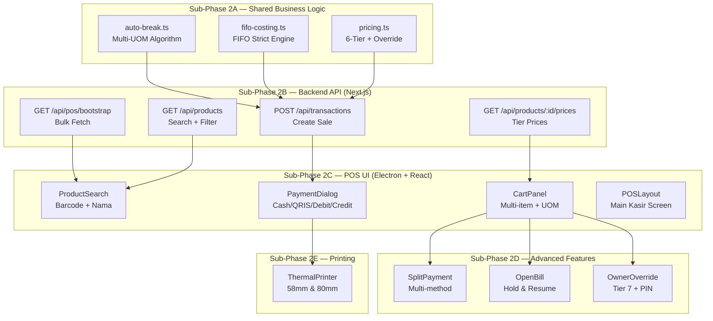
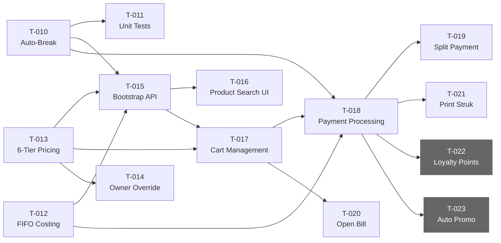

# Phase 2 — Core POS Sales: Implementation Plan

> **Scope**: Task T-010 s/d T-023 dari [progress-tracker.md](file:///c:/Users/cundus/Documents/Project/hammielion/hammielion-monorepo/docs/progress-tracker.md)
> **Prerequisite**: Phase 1 (Foundation) ✅ 100% — Monorepo, DB Schema, Auth, RBAC sudah selesai
> **Estimated Effort**: Besar — dipecah jadi **5 sub-phase** agar manageable

---

## User Review Required

> [!IMPORTANT]
> Beberapa keputusan kritis perlu konfirmasi sebelum implementasi dimulai. Silakan review bagian **Open Questions** di bawah.

> [!WARNING]
> Phase 2 ini sangat besar (14 task). Direkomendasikan eksekusi secara **sequential per sub-phase** (2A → 2B → 2C → 2D → 2E) untuk menghindari rework.

---

## Architecture Overview



---

## Sub-Phase 2A — Business Logic Layer (packages/shared)

> **Goal**: Implementasi pure-function algorithms yang bisa di-unit test tanpa UI/DB dependency.

### Mengapa di `packages/shared`?
- Algoritma Auto-Break, FIFO, dan Pricing adalah **pure business logic**
- Bisa dipakai oleh Backend (validasi server-side) DAN Frontend (kalkulasi real-time)
- Mudah di-unit test secara isolated

---

### [NEW] `packages/shared/src/utils/auto-break.ts`

**Task**: T-010 — Implementasi algoritma Auto-Break Multi-UOM

Implementasi sesuai PRD [§5.1.3](file:///c:/Users/cundus/Documents/Project/hammielion/hammielion-monorepo/docs/pos_prd_1/05.1-multi-uom.md):

```typescript
// Core types
interface StockState {
  qtyBesar: number;   // Stock UOM Besar (Sak/Dus)
  qtyKecil: number;   // Stock UOM Kecil (Pcs/Gram)
  conversionRatio: number; // 1 Besar = N Kecil
}

interface SellResult {
  success: boolean;
  newQtyBesar: number;
  newQtyKecil: number;
  autoBreakTriggered: boolean;
  sacsBreached: number; // Jumlah UOM besar yang dipecah
  error?: string;
}

// CASE 1: Jual UOM Besar → kurangi langsung
// CASE 2A: Jual UOM Kecil, stock cukup → kurangi langsung
// CASE 2B: Jual UOM Kecil, stock kurang → Auto-Break + FIFO
function sellProduct(stock: StockState, uomType: 'besar' | 'kecil', qtyToSell: number): SellResult
```

**Acceptance Criteria**:
- ✅ Case 1: Jual Sak langsung kurangi stock Sak
- ✅ Case 2A: Jual Pcs cukup, kurangi Pcs saja
- ✅ Case 2B: Deficit → CEIL(deficit/ratio) Sak dipecah
- ✅ Error jika total stock tidak cukup
- ✅ Return auto_break_flag + jumlah Sak yang dipecah

---

### [NEW] `packages/shared/src/utils/auto-break.test.ts`

**Task**: T-011 — Unit test Auto-Break (6+ edge cases)

Test cases berdasarkan [§5.1.4](file:///c:/Users/cundus/Documents/Project/hammielion/hammielion-monorepo/docs/pos_prd_1/05.1-multi-uom.md) + [§10.1 Decision Table](file:///c:/Users/cundus/Documents/Project/hammielion/hammielion-monorepo/docs/pos_prd_1/10-business-rules.md):

| # | Stock Awal | Aksi | Expected Result |
|---|-----------|------|-----------------|
| 1 | 9 Sak, 20 Pcs | Jual 1 Pcs | 9 Sak, 19 Pcs ✅ |
| 2 | 9 Sak, 20 Pcs | Jual 20 Pcs | 9 Sak, 0 Pcs (habis) ✅ |
| 3 | 9 Sak, 20 Pcs | Jual 25 Pcs | 8 Sak, 25 Pcs (break 1 Sak) ✅ |
| 4 | 9 Sak, 20 Pcs | Jual 50 Pcs | 8 Sak, 0 Pcs (break 1 Sak) ✅ |
| 5 | 9 Sak, 20 Pcs | Jual 51 Pcs | 7 Sak, 29 Pcs (break 2 Sak) ✅ |
| 6 | 2 Sak, 10 Pcs | Jual 80 Pcs | ERROR: stock tidak cukup ❌ |
| 7 | 0 Sak, 0 Pcs | Jual 1 Pcs | ERROR: stock kosong ❌ |
| 8 | 9 Sak, 20 Pcs | Jual 2 Sak | 7 Sak, 20 Pcs (Pcs tidak berubah) ✅ |

**Setup**: Install `vitest` di workspace root untuk testing

---

### [NEW] `packages/shared/src/utils/fifo-costing.ts`

**Task**: T-012 — Implementasi FIFO costing (strict, per batch)

Implementasi sesuai PRD [§5.3](file:///c:/Users/cundus/Documents/Project/hammielion/hammielion-monorepo/docs/pos_prd_1/05.3-fifo-costing.md):

```typescript
interface StockBatch {
  batchId: number;
  qtyRemaining: number; // In base UOM
  costPrice: number;     // Cost per base UOM
  receivedAt: Date;
}

interface FifoDeductionResult {
  deductions: Array<{
    batchId: number;
    qtyDeducted: number;
    costPrice: number;
    totalCost: number;
  }>;
  totalCogs: number;     // Sum of all deduction costs
  batchesAfter: StockBatch[]; // Updated batches
}

// Deduct qty dari batch terlama, return COGS calculation
function fifoDeduct(batches: StockBatch[], qtyToDeduct: number): FifoDeductionResult
```

**Key Rules**:
- Batch terlama **diprioritaskan** (sort by `receivedAt ASC`)
- Jika 1 batch tidak cukup, lanjut ke batch berikutnya
- Return total COGS (sum cost per batch yang diambil)
- Auto-break pecahan tetap **trace ke batch asal** (`parent_batch_id`)
- Harga modal UOM kecil = Harga modal UOM besar / conversion ratio

---

### [NEW] `packages/shared/src/utils/pricing.ts`

**Task**: T-013 — Implementasi 6-tier pricing per produk per cabang

```typescript
type PriceTier = 'RETAIL' | 'GROSIR' | 'MEMBER' | 'DISTRIBUTOR' | 'RESELLER' | 'PROMO';

interface PriceLookup {
  productId: number;
  branchId: number;
  uomId: number;
  tier: PriceTier;
}

interface PriceResult {
  price: number;
  tier: PriceTier;
  isPromoApplied: boolean;
  originalPrice?: number; // Jika promo override
}

// Lookup harga dari price map (pre-fetched dari API)
function getPrice(priceMap: Map<string, number>, lookup: PriceLookup): PriceResult
function getAllTierPrices(priceMap: Map<string, number>, productId: number, branchId: number, uomId: number): Record<PriceTier, number | null>
```

**Task**: T-014 — Owner Price Override (Tier 7)

```typescript
interface OwnerOverrideRequest {
  productId: number;
  uomId: number;
  overridePrice: number;
  lowestTierPrice: number; // For validation
}

interface OwnerOverrideResult {
  approved: boolean;
  requiresWarning: boolean; // true if override < 50% retail
  price: number;
}

function validateOwnerOverride(request: OwnerOverrideRequest): OwnerOverrideResult
```

---

## Sub-Phase 2B — Backend API Layer (apps/backoffice)

> **Goal**: API endpoints yang dipakai POS Electron app via `apiClient`.

### API Route Structure

```
apps/backoffice/app/api/
├── auth/login/route.ts          ← Sudah ada (Phase 1)
├── health/route.ts              ← Sudah ada (Phase 1)
├── pos/
│   ├── bootstrap/route.ts       ← T-015 (NEW)
│   └── transactions/route.ts    ← T-018 (NEW)
├── products/
│   ├── route.ts                 ← T-016 (NEW) — Search
│   └── [id]/
│       └── prices/route.ts      ← T-013 (NEW) — Tier prices
├── customers/
│   └── route.ts                 ← T-015 (NEW) — List
└── open-bills/
    └── route.ts                 ← T-020 (NEW) — CRUD
```

---

### [NEW] `apps/backoffice/app/api/pos/bootstrap/route.ts`

**Task**: T-015 — Bootstrap endpoint

```
GET /api/pos/bootstrap?branchId=1
```

Response berisi **semua data** yang dibutuhkan POS saat startup:

```json
{
  "products": [...],       // Produk aktif + UOM conversions
  "prices": [...],         // All prices untuk branch ini
  "customers": [...],      // Daftar customer (untuk piutang/member)
  "uoms": [...],           // Master UOM list
  "paymentMethods": [...], // Cash, QRIS, Debit, Kredit
  "priceTiers": [...],     // Available tier types per branch
  "lastUpdated": "2026-04-18T..."
}
```

**Join Strategy**: Products di-join dengan `product_uom_conversions`, `product_prices`, dan `product_stocks` di satu query efisien.

---

### [NEW] `apps/backoffice/app/api/products/route.ts`

**Task**: T-016 — Search products

```
GET /api/products?q=pakan&branchId=1&limit=20
GET /api/products?barcode=123456789
```

- Full-text search by name + SKU
- Barcode exact match
- Include UOM conversions inline
- Include stock per branch

---

### [NEW] `apps/backoffice/app/api/pos/transactions/route.ts`

**Task**: T-018 — Create transaction

```
POST /api/pos/transactions
```

Request body:

```json
{
  "branchId": 1,
  "shiftId": 5,
  "customerId": null,
  "items": [
    {
      "productId": 10,
      "uomId": 2,
      "qty": 25,
      "priceTier": "RETAIL",
      "unitPrice": 5000,
      "isOwnerOverride": false
    }
  ],
  "payments": [
    { "paymentMethodId": 1, "amount": 125000 }
  ]
}
```

**Server-side validations**:
1. Re-validate stock availability (re-run auto-break)
2. Re-validate harga (prevent client-side tampering)
3. Execute FIFO deduction (update `product_stock_batches`)
4. Update `product_stocks` (aggregate qty)
5. Log auto-break events ke `stock_auto_breaks`
6. Calculate & snapshot COGS per item
7. Generate `trx_number` (format: `TRX-{YYYYMMDD}-{increment}`)
8. Return transaction with print-ready data

**Transaction atomicity**: Wrap semua dalam DB transaction (Drizzle `db.transaction()`)

---

### [NEW] `apps/backoffice/app/api/open-bills/route.ts`

**Task**: T-020 — Open Bill CRUD

```
POST /api/open-bills         — Create held bill
GET  /api/open-bills?shiftId=5 — List open bills
PUT  /api/open-bills/:id     — Resume → convert ke draft
DELETE /api/open-bills/:id   — Cancel
```

---

## Sub-Phase 2C — POS UI (Kasir Interface)

> **Goal**: Full POS kasir screen — product search, cart, payment.
> **Tech**: React + Tailwind CSS + shadcn/ui + Zustand + TanStack Query

### Layout Architecture

```
┌─────────────────────────────────────────────────┐
│ Header: Branch | Shift | Kasir | Clock          │
├──────────────────────┬──────────────────────────┤
│                      │                          │
│  Product Search      │   Cart Panel             │
│  ┌────────────────┐  │   ┌──────────────────┐   │
│  │ 🔍 Search bar  │  │   │ Item 1   5 Pcs   │   │
│  │ [barcode scan] │  │   │ Tier: Retail      │   │
│  ├────────────────┤  │   │ Rp 25.000         │   │
│  │ Product Grid   │  │   ├──────────────────┤   │
│  │ ┌──┐ ┌──┐ ┌──┐│  │   │ Item 2   1 Sak   │   │
│  │ │  │ │  │ │  ││  │   │ Tier: Grosir      │   │
│  │ └──┘ └──┘ └──┘│  │   │ Rp 100.000        │   │
│  │ ┌──┐ ┌──┐ ┌──┐│  │   ├──────────────────┤   │
│  │ │  │ │  │ │  ││  │   │                    │   │
│  │ └──┘ └──┘ └──┘│  │   │ Subtotal: Rp 125k │   │
│  └────────────────┘  │   │ Discount: -0      │   │
│                      │   │ TOTAL: Rp 125.000  │   │
│  Category Tabs       │   ├──────────────────┤   │
│  [Semua][Pakan][...] │   │ [Tahan]  [Bayar] │   │
│                      │   └──────────────────┘   │
└──────────────────────┴──────────────────────────┘
```

---

### Component Tree

```
src/
├── pages/
│   ├── Login.tsx                    ← Sudah ada
│   └── POS.tsx                      ← NEW: Main POS screen
├── components/
│   ├── ui/                          ← shadcn components
│   │   ├── button.tsx
│   │   ├── input.tsx
│   │   ├── dialog.tsx
│   │   ├── select.tsx
│   │   ├── badge.tsx
│   │   ├── separator.tsx
│   │   ├── scroll-area.tsx
│   │   └── sheet.tsx
│   ├── layout/
│   │   ├── POSLayout.tsx            ← NEW: 2-column layout
│   │   └── POSHeader.tsx            ← NEW: Top bar
│   ├── pos/
│   │   ├── ProductSearch.tsx        ← T-016: Search + barcode
│   │   ├── ProductGrid.tsx          ← Product card grid
│   │   ├── ProductCard.tsx          ← Single product card
│   │   ├── CartPanel.tsx            ← T-017: Cart sidebar
│   │   ├── CartItem.tsx             ← Single cart item row
│   │   ├── UomSelector.tsx          ← T-017: Dropdown UOM
│   │   ├── TierPriceSelector.tsx    ← T-013: Tier picker
│   │   ├── PaymentDialog.tsx        ← T-018: Payment modal
│   │   ├── SplitPaymentForm.tsx     ← T-019: Split payment
│   │   ├── OpenBillsDrawer.tsx      ← T-020: Open bills sidebar
│   │   ├── OwnerOverrideDialog.tsx  ← T-014: Owner override modal
│   │   ├── PinChallengeDialog.tsx   ← PIN verification modal
│   │   └── AutoBreakNotice.tsx      ← Auto-break notification banner
│   └── receipt/
│       └── ReceiptPreview.tsx       ← T-021: Print preview
├── store/
│   ├── auth-store.ts               ← Sudah ada
│   ├── cart-store.ts               ← NEW: Cart state (Zustand)
│   ├── pos-store.ts                ← NEW: POS global state
│   └── open-bill-store.ts          ← NEW: Open bills state
├── hooks/
│   ├── useProducts.ts              ← TanStack Query hook
│   ├── useBootstrap.ts             ← Bootstrap data hook
│   ├── useTransaction.ts           ← Create transaction mutation
│   └── useBarcodeScanner.ts        ← USB barcode listener
└── lib/
    ├── api-client.ts               ← Sudah ada
    └── print-service.ts            ← NEW: Electron IPC print bridge
```

---

### [NEW] `src/store/cart-store.ts`

**Task**: T-017 — Cart management

```typescript
interface CartItem {
  productId: number;
  productName: string;
  uomId: number;
  uomCode: string;
  qty: number;
  unitPrice: number;
  priceTier: PriceTier;
  discountAmount: number;
  subtotal: number;            // (unitPrice * qty) - discountAmount
  isOwnerOverride: boolean;
  overridePrice?: number;
  autoBreakTriggered?: boolean;
  autoBreakQty?: number;
}

interface CartState {
  items: CartItem[];
  customerId: number | null;
  
  // Actions
  addItem(item: Omit<CartItem, 'subtotal'>): void;
  removeItem(productId: number, uomId: number): void;
  updateQty(productId: number, uomId: number, qty: number): void;
  updateTier(productId: number, uomId: number, tier: PriceTier, price: number): void;
  setCustomer(customerId: number | null): void;
  clearCart(): void;
  
  // Computed
  getSubtotal(): number;
  getDiscountTotal(): number;
  getGrandTotal(): number;
  getItemCount(): number;
}
```

---

### [NEW] `src/components/pos/ProductSearch.tsx`

**Task**: T-016 — Product search (barcode + nama)

**Features**:
- Real-time search debounced (300ms)
- Barcode auto-detect via USB scanner (prefix/suffix detection)
- Category tabs filter
- Keyboard shortcut: `F2` focus search bar
- Show stock info per item (qty Sak + qty Pcs)
- Visual indicator: "Stok Rendah" jika < threshold

---

### [NEW] `src/components/pos/PaymentDialog.tsx`

**Task**: T-018 — Payment processing

**Payment Methods**:
| Method | Field | Validasi |
|--------|-------|---------|
| Cash | Nominal bayar | ≥ grand total, hitung kembalian |
| QRIS | Reference number | Wajib isi, konfirmasi manual |
| Debit | Reference number | Wajib isi |
| Kredit | Reference number | Wajib isi |

**Flow**:
1. Tampilkan grand total
2. Pilih payment method (tabs/cards)
3. Input nominal
4. Validasi
5. Submit → API → Print struk

---

## Sub-Phase 2D — Advanced Features

### [NEW] `src/components/pos/SplitPaymentForm.tsx`

**Task**: T-019 — Split payment

- Add multiple payment rows (method + amount)
- Running total: sum of all payments
- Validasi: total payments ≥ grand total
- Kalkulasi kembalian dari row Cash terakhir
- Max 5 split methods

---

### [NEW] `src/components/pos/OpenBillsDrawer.tsx`

**Task**: T-020 — Open Bill

**Flow**:
1. Kasir klik "Tahan Transaksi" → cart disimpan ke DB via API
2. Cart di-clear, kasir bisa serve customer lain
3. List open bills di drawer (slide from right)
4. Klik open bill → restore cart items
5. Lanjut checkout normal

**State**: Tiap bill punya nama/kode identifikasi + timestamp

---

### [NEW] `src/components/pos/OwnerOverrideDialog.tsx`

**Task**: T-014 — Owner Price Override (Tier 7)

**Flow sesuai PRD [§5.4.5](file:///c:/Users/cundus/Documents/Project/hammielion/hammielion-monorepo/docs/pos_prd_1/05.4-sales-transaction.md)**:
1. Button "Owner Override" hanya tampil jika `user.role === 'OWNER'`
2. Click → trigger PIN challenge dialog
3. PIN verified → input harga manual
4. Validasi: tidak boleh Rp 0
5. Warning modal jika override < 50% from retail
6. Apply ke cart item → label "Owner Override"
7. Audit log di-create server-side saat transaksi submit

---

## Sub-Phase 2E — Thermal Printing

### [NEW] `electron/services/printer-service.ts`

**Task**: T-021 — Print struk thermal

**Architecture (AD-017)**:
```
POS React App → IPC invoke → Electron Main Process → node-thermal-printer → USB/Network Printer
```

**Supported formats**:
- 58mm (32 chars per line)
- 80mm (48 chars per line)

**Struk Template**:
```
================================
      HAMMIELION PETSHOP
    [Nama Cabang]
    [Alamat Cabang]
================================
No. Struk  : TRX-20260418-001
Kasir      : Ahmad
Tanggal    : 18/04/2026 14:30
================================
Pakan Kucing 1kg
  1 Sak x Rp 100.000
                  Rp   100.000
Pasir Premium 5L
  5 Pcs x Rp 15.000
                  Rp    75.000
--------------------------------
Subtotal       :  Rp   175.000
Diskon         : -Rp         0
================================
GRAND TOTAL    :  Rp   175.000
================================
Bayar (Cash)   :  Rp   200.000
Kembalian      :  Rp    25.000
================================
    Terima kasih!
    Hammielion Petshop
================================
```

### [NEW] `apps/pos-desktop/src/lib/print-service.ts`

IPC bridge: React side calls `window.ipcRenderer.invoke('print-receipt', receiptData)`

---

## Task Dependency Graph



> [!NOTE]
> T-022 (Loyalty Points) di-**defer** karena mekanisme tukar point belum didefinisikan (OQ-001).
> T-023 (Auto-apply promo) di-**defer** karena butuh Discount Engine dari Phase 6.

---

## Execution Order

### Batch 1 — Pure Business Logic (Sub-Phase 2A)
| # | Task ID | Deskripsi | Files |
|---|---------|-----------|-------|
| 1 | T-010 | Auto-Break Algorithm | `packages/shared/src/utils/auto-break.ts` |
| 2 | T-011 | Unit Tests Auto-Break | `packages/shared/src/utils/auto-break.test.ts` |
| 3 | T-012 | FIFO Costing Engine | `packages/shared/src/utils/fifo-costing.ts` |
| 4 | T-013 | 6-Tier Pricing Logic | `packages/shared/src/utils/pricing.ts` |

### Batch 2 — Backend APIs (Sub-Phase 2B)
| # | Task ID | Deskripsi | Files |
|---|---------|-----------|-------|
| 5 | T-015 | Bootstrap API | `apps/backoffice/app/api/pos/bootstrap/route.ts` |
| 6 | T-015 | Products Search API | `apps/backoffice/app/api/products/route.ts` |
| 7 | T-015 | Customer List API | `apps/backoffice/app/api/customers/route.ts` |
| 8 | T-013 | Product Prices API | `apps/backoffice/app/api/products/[id]/prices/route.ts` |

### Batch 3 — Core POS UI (Sub-Phase 2C)
| # | Task ID | Deskripsi | Files |
|---|---------|-----------|-------|
| 9 | — | Setup shadcn/ui components | `src/components/ui/*.tsx` |
| 10 | — | POSLayout + Header | `src/components/layout/*.tsx` |
| 11 | T-016 | Product Search UI | `src/components/pos/ProductSearch.tsx` |
| 12 | T-017 | Cart Management | `src/store/cart-store.ts`, `src/components/pos/Cart*.tsx` |
| 13 | T-018 | Payment Dialog | `src/components/pos/PaymentDialog.tsx` |

### Batch 4 — Advanced + Print (Sub-Phase 2D + 2E)
| # | Task ID | Deskripsi | Files |
|---|---------|-----------|-------|
| 14 | T-019 | Split Payment | `src/components/pos/SplitPaymentForm.tsx` |
| 15 | T-020 | Open Bill | `src/components/pos/OpenBillsDrawer.tsx` |
| 16 | T-014 | Owner Override | `src/components/pos/OwnerOverrideDialog.tsx` |
| 17 | T-021 | Thermal Printing | `electron/services/printer-service.ts` |

---

## Proposed Changes Summary

### `packages/shared` (Business Logic)

| Status | File | Purpose |
|--------|------|---------|
| [NEW] | `src/utils/auto-break.ts` | Multi-UOM auto-break algorithm |
| [NEW] | `src/utils/auto-break.test.ts` | 8+ test cases |
| [NEW] | `src/utils/fifo-costing.ts` | FIFO strict deduction engine |
| [NEW] | `src/utils/fifo-costing.test.ts` | FIFO test cases |
| [NEW] | `src/utils/pricing.ts` | 6-tier pricing + owner override validation |
| [MODIFY] | `src/utils/index.ts` | Export new modules |
| [MODIFY] | `src/types/product.ts` | Extend with UOM conversion types |
| [NEW] | `src/types/cart.ts` | Cart item & cart state types |
| [NEW] | `src/types/payment.ts` | Payment method & split payment types |

---

### `apps/backoffice` (Backend API)

| Status | File | Purpose |
|--------|------|---------|
| [NEW] | `app/api/pos/bootstrap/route.ts` | Bulk data fetch for POS startup |
| [NEW] | `app/api/products/route.ts` | Product search (name/barcode) |
| [NEW] | `app/api/products/[id]/prices/route.ts` | Tier prices per product |
| [NEW] | `app/api/customers/route.ts` | Customer list |
| [NEW] | `app/api/pos/transactions/route.ts` | Create transaction (POST) |
| [NEW] | `app/api/open-bills/route.ts` | Open bill CRUD |
| [NEW] | `lib/services/stock-service.ts` | Stock deduction + FIFO logic |
| [NEW] | `lib/services/transaction-service.ts` | Transaction creation orchestrator |

---

### `apps/pos-desktop` (Electron + React)

| Status | File | Purpose |
|--------|------|---------|
| [MODIFY] | `src/App.tsx` | Add routing (Login → POS) |
| [NEW] | `src/pages/POS.tsx` | Main POS cashier screen |
| [NEW] | `src/components/layout/POSLayout.tsx` | 2-column responsive layout |
| [NEW] | `src/components/layout/POSHeader.tsx` | Top bar (branch, shift, user) |
| [NEW] | `src/components/pos/ProductSearch.tsx` | Search + barcode scanner |
| [NEW] | `src/components/pos/ProductGrid.tsx` | Product card grid |
| [NEW] | `src/components/pos/ProductCard.tsx` | Single product card |
| [NEW] | `src/components/pos/CartPanel.tsx` | Cart sidebar |
| [NEW] | `src/components/pos/CartItem.tsx` | Cart item row |
| [NEW] | `src/components/pos/UomSelector.tsx` | UOM dropdown |
| [NEW] | `src/components/pos/TierPriceSelector.tsx` | Tier price picker |
| [NEW] | `src/components/pos/PaymentDialog.tsx` | Payment modal |
| [NEW] | `src/components/pos/SplitPaymentForm.tsx` | Split payment UI |
| [NEW] | `src/components/pos/OpenBillsDrawer.tsx` | Held bills sidebar |
| [NEW] | `src/components/pos/OwnerOverrideDialog.tsx` | Owner override modal |
| [NEW] | `src/components/pos/PinChallengeDialog.tsx` | PIN verification |
| [NEW] | `src/components/pos/AutoBreakNotice.tsx` | Auto-break notification |
| [NEW] | `src/store/cart-store.ts` | Cart state (Zustand) |
| [NEW] | `src/store/pos-store.ts` | POS global state |
| [NEW] | `src/store/open-bill-store.ts` | Open bills state |
| [NEW] | `src/hooks/useProducts.ts` | Product query hook |
| [NEW] | `src/hooks/useBootstrap.ts` | Bootstrap data hook |
| [NEW] | `src/hooks/useTransaction.ts` | Transaction mutation |
| [NEW] | `src/hooks/useBarcodeScanner.ts` | USB barcode listener |
| [NEW] | `src/lib/print-service.ts` | IPC print bridge |
| [NEW] | `electron/services/printer-service.ts` | node-thermal-printer wrapper |

---

## Open Questions

> [!IMPORTANT]
> **OQ-P2-001**: Untuk **routing** di POS Electron app, mau pakai library apa?
> - **Opsi A**: `react-router-dom` (standard, full routing)
> - **Opsi B**: Simple state-based routing (Zustand `currentPage`, tanpa URL routing — karena Electron tidak butuh URL)
> - **Rekomendasi**: Opsi B — POS hanya punya 2-3 screen (Login, POS, Settings), tidak butuh URL-based routing

> [!IMPORTANT]
> **OQ-P2-002**: Apakah **barcode scanner** USB sudah tersedia untuk testing?
> - Barcode scanner USB biasanya output sebagai keyboard input (HID device)
> - Implementasi pakai global keydown listener dengan prefix/suffix detection
> - Jika belum ada, input manual tetap jalan — barcode scanner bisa ditambahkan later

> [!IMPORTANT]
> **OQ-P2-003**: Apakah perlu **seed data produk** dummy untuk development?
> - Direkomendasikan: seed 20-30 produk dengan UOM conversions, prices, dan stock batches
> - Termasuk: kategori (Pakan, Aksesoris, Obat, dll), brands, pricing tier lengkap
> - Ini akan mempercepat development UI secara signifikan

> [!WARNING]
> **OQ-P2-004**: Task T-022 (Loyalty Points) dan T-023 (Auto-apply Promo) — apakah tetap mau diimplementasi di Phase 2, atau defer ke phase terkait?
> - T-022: Mekanisme tukar point **belum didefinisikan** (OQ-001 masih open)
> - T-023: Butuh Discount Engine yang ada di Phase 6 (T-066, T-067)
> - **Rekomendasi**: Defer keduanya — fokus ke core sales flow dulu

---

## Verification Plan

### Automated Tests
- `vitest` unit tests untuk Auto-Break algorithm (8+ cases)
- `vitest` unit tests untuk FIFO deduction (5+ cases)
- `vitest` unit tests untuk Pricing logic (6-tier + override validation)
- API integration tests via `curl` / Postman

### Manual Verification
1. **Full sales flow**: Login → Search produk → Add to cart → Pilih UOM → Pilih tier → Bayar → Print struk
2. **Auto-break scenario**: Jual Pcs melebihi stock → pastikan Sak otomatis dipecah
3. **Split payment**: Bayar dengan 2 method (Cash + QRIS)
4. **Open bill**: Tahan transaksi → serve customer lain → resume open bill
5. **Owner override**: Login sebagai Owner → override harga → verify audit log
6. **Thermal print**: Test cetak ke printer 58mm dan 80mm (jika tersedia)

### Browser Testing
- Jalankan `pnpm dev` di pos-desktop
- Verify semua UI component render dengan benar
- Test responsive layout (Electron window resize)
- Test keyboard shortcuts (F2 search, Enter submit)

---

*Dibuat: 2026-04-18 | Phase: 2 — Core POS Sales | Tasks: T-010 s/d T-023*
