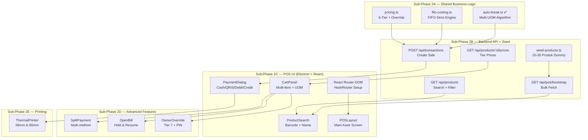

# Phase 2 — Core POS Sales: Implementation Plan (Revised)

> **Scope**: Task T-010 s/d T-021 dari [progress-tracker.md](file:///c:/Users/cundus/Documents/Project/hammielion/hammielion-monorepo/docs/progress-tracker.md)
> **Prerequisite**: Phase 1 (Foundation) ✅ 100% — Monorepo, DB Schema, Auth, RBAC sudah selesai
> **Already Done**: T-010 (auto-break.ts) ✅, T-011 (auto-break.test.ts) ✅
> **Estimated Effort**: Besar — dipecah jadi **5 sub-phase** agar manageable

---

## Resolved Open Questions

| # | Pertanyaan | Jawaban User |
|---|-----------|--------------|
| OQ-P2-001 | Routing di POS Electron | **React Router DOM** — gunakan `react-router-dom` dengan `HashRouter` (cocok untuk Electron) |
| OQ-P2-002 | Barcode scanner USB | **Sudah ada** — implementasi HID keyboard listener |
| OQ-P2-003 | Seed data produk dummy | **Perlu** — seed 20-30 produk lengkap (UOM, prices, stock batches) |
| OQ-P2-004 | T-022 & T-023 | **Defer** — fokus core sales flow dulu |

---

## Architecture Overview



---

## Sub-Phase 2A — Business Logic Layer (packages/shared)

> **Goal**: Implementasi pure-function algorithms yang bisa di-unit test tanpa UI/DB dependency.
> **Status**: T-010 & T-011 (auto-break) sudah selesai ✅

---

### ✅ [DONE] `packages/shared/src/utils/auto-break.ts` — T-010
### ✅ [DONE] `packages/shared/src/utils/auto-break.test.ts` — T-011

---

### [NEW] `packages/shared/src/utils/fifo-costing.ts`

**Task**: T-012 — Implementasi FIFO costing (strict, per batch)

```typescript
interface StockBatch {
  batchId: number;
  qtyRemaining: number; // In base UOM
  costPrice: number;     // Cost per base UOM
  receivedAt: Date;
}

interface FifoDeductionResult {
  deductions: Array<{
    batchId: number;
    qtyDeducted: number;
    costPrice: number;
    totalCost: number;
  }>;
  totalCogs: number;     // Sum of all deduction costs
  batchesAfter: StockBatch[]; // Updated batches
}

function fifoDeduct(batches: StockBatch[], qtyToDeduct: number): FifoDeductionResult
```

**Key Rules**:
- Batch terlama **diprioritaskan** (sort by `receivedAt ASC`)
- Jika 1 batch tidak cukup, lanjut ke batch berikutnya
- Return total COGS (sum cost per batch yang diambil)
- Auto-break pecahan tetap **trace ke batch asal** (`parent_batch_id`)
- Harga modal UOM kecil = Harga modal UOM besar / conversion ratio

### [NEW] `packages/shared/src/utils/fifo-costing.test.ts`

Test cases:
1. Single batch, qty cukup
2. Single batch, qty habis pas
3. Multi-batch, span 2 batches
4. Multi-batch, 3+ batches
5. Qty melebihi total stock → error
6. Empty batches → error

---

### [NEW] `packages/shared/src/utils/pricing.ts`

**Task**: T-013 — Implementasi 6-tier pricing per produk per cabang

```typescript
type PriceTier = 'RETAIL' | 'GROSIR' | 'MEMBER' | 'DISTRIBUTOR' | 'RESELLER' | 'PROMO';

interface PriceLookup {
  productId: number;
  branchId: number;
  uomId: number;
  tier: PriceTier;
}

interface PriceResult {
  price: number;
  tier: PriceTier;
  isPromoApplied: boolean;
  originalPrice?: number;
}

function getPrice(priceMap: Map<string, number>, lookup: PriceLookup): PriceResult
function getAllTierPrices(priceMap: Map<string, number>, productId: number, branchId: number, uomId: number): Record<PriceTier, number | null>
```

**Task**: T-014 — Owner Price Override (Tier 7) validation logic

```typescript
interface OwnerOverrideRequest {
  productId: number;
  uomId: number;
  overridePrice: number;
  lowestTierPrice: number;
}

interface OwnerOverrideResult {
  approved: boolean;
  requiresWarning: boolean; // true if override < 50% retail
  price: number;
}

function validateOwnerOverride(request: OwnerOverrideRequest): OwnerOverrideResult
```

### [NEW] `packages/shared/src/utils/pricing.test.ts`

Test cases untuk pricing lookup dan owner override validation.

---

### [MODIFY] `packages/shared/src/utils/index.ts`

Tambah export baru:
```typescript
export * from './fifo-costing.js';
export * from './pricing.js';
```

### [NEW] `packages/shared/src/types/cart.ts`

Cart item & cart state type definitions (shared antara frontend dan backend validation).

### [NEW] `packages/shared/src/types/payment.ts`

Payment method & split payment type definitions.

### [MODIFY] `packages/shared/src/types/product.ts`

Extend dengan `ProductUomConversion` type dan type untuk stock batch.

### [MODIFY] `packages/shared/src/types/index.ts`

Tambah export `cart.ts` dan `payment.ts`.

---

## Sub-Phase 2B — Backend API Layer + Seed Data

> **Goal**: API endpoints yang dipakai POS Electron app + seed data produk untuk development.

### [NEW] `packages/db/src/seed-products.ts`

**Task**: OQ-P2-003 — Seed data produk dummy untuk development

Seed **25+ produk** pet shop lengkap:

| # | Kategori | Contoh Produk | UOM | Conversion |
|---|----------|--------------|-----|------------|
| 1–5 | Pakan Kucing | Royal Canin Indoor 2kg, Whiskas Tuna 480g, dll | SAK/PCS | 1:12 |
| 6–10 | Pakan Anjing | Dog Chow 10kg, Pedigree Wet Food, dll | SAK/PCS | 1:6 |
| 11–14 | Pasir Kucing | Pasir Wangi 25L, Pasir Bentonite 5L, dll | SAK/PCS | 1:5 |
| 15–18 | Aksesoris | Collar, Tempat Makan, Mainan Bola, dll | PCS/BOX | 1:12 |
| 19–22 | Obat & Vitamin | Obat Kutu, Vitamin Bulu, Shampo Anti Kutu, dll | PCS/DUS | 1:24 |
| 23–25 | Snack & Treat | Temptations, Catit Creamy, dll | PACK/BOX | 1:20 |

Data yang di-seed per produk:
- `products` — name, sku, barcode, category, brand, base_uom
- `product_uom_conversions` — ratio UOM besar ke kecil
- `product_prices` — 6 tier prices per branch (RETAIL, GROSIR, MEMBER, DISTRIBUTOR, RESELLER, PROMO)
- `product_stocks` — stock per branch per UOM
- `product_stock_batches` — 2-3 batches per produk (untuk testing FIFO)
- `categories` — Pakan Kucing, Pakan Anjing, Pasir, Aksesoris, Obat, Snack
- `brands` — Royal Canin, Whiskas, Pedigree, dll
- `customers` — 5 sample customers

---

### API Route Structure

```
apps/backoffice/app/api/
├── auth/login/route.ts          ← Sudah ada (Phase 1)
├── health/route.ts              ← Sudah ada (Phase 1)
├── pos/
│   ├── bootstrap/route.ts       ← T-015 (NEW)
│   └── transactions/route.ts    ← T-018 (NEW)
├── products/
│   ├── route.ts                 ← T-016 (NEW) — Search
│   └── [id]/
│       └── prices/route.ts      ← T-013 (NEW) — Tier prices
├── customers/
│   └── route.ts                 ← T-015 (NEW) — List
└── open-bills/
    └── route.ts                 ← T-020 (NEW) — CRUD
```

---

### [NEW] `apps/backoffice/app/api/pos/bootstrap/route.ts`

**Task**: T-015 — Bootstrap endpoint

```
GET /api/pos/bootstrap?branchId=1
```

Response berisi **semua data** yang dibutuhkan POS saat startup:

```json
{
  "products": [...],       // Produk aktif + UOM conversions
  "prices": [...],         // All prices untuk branch ini
  "customers": [...],      // Daftar customer
  "uoms": [...],           // Master UOM list
  "paymentMethods": [...], // Cash, QRIS, Debit, Kredit
  "priceTiers": [...],     // Available tier types per branch
  "lastUpdated": "2026-04-18T..."
}
```

**Join Strategy**: Products di-join dengan `product_uom_conversions`, `product_prices`, dan `product_stocks` di satu query efisien.

---

### [NEW] `apps/backoffice/app/api/products/route.ts`

**Task**: T-016 — Search products

```
GET /api/products?q=pakan&branchId=1&limit=20
GET /api/products?barcode=123456789
```

- Full-text search by name + SKU
- Barcode exact match
- Include UOM conversions inline
- Include stock per branch

---

### [NEW] `apps/backoffice/app/api/products/[id]/prices/route.ts`

**Task**: T-013 — Tier prices endpoint

```
GET /api/products/10/prices?branchId=1
```

Return all 6 tier prices + owner override status for a specific product.

---

### [NEW] `apps/backoffice/app/api/pos/transactions/route.ts`

**Task**: T-018 — Create transaction

```
POST /api/pos/transactions
```

**Server-side validations**:
1. Re-validate stock availability (re-run auto-break)
2. Re-validate harga (prevent client-side tampering)
3. Execute FIFO deduction (update `product_stock_batches`)
4. Update `product_stocks` (aggregate qty)
5. Log auto-break events ke `stock_auto_breaks`
6. Calculate & snapshot COGS per item
7. Generate `trx_number` (format: `TRX-{YYYYMMDD}-{increment}`)
8. Return transaction with print-ready data

**Transaction atomicity**: Wrap semua dalam DB transaction (Drizzle `db.transaction()`)

---

### [NEW] `apps/backoffice/app/api/customers/route.ts`

```
GET /api/customers?q=budi&limit=20
```

---

### [NEW] `apps/backoffice/app/api/open-bills/route.ts`

**Task**: T-020 — Open Bill CRUD

```
POST /api/open-bills         — Create held bill
GET  /api/open-bills?shiftId=5 — List open bills
PUT  /api/open-bills/:id     — Resume → convert ke draft
DELETE /api/open-bills/:id   — Cancel
```

---

### [NEW] `apps/backoffice/lib/services/stock-service.ts`

Stock deduction + FIFO logic server-side orchestrator.

### [NEW] `apps/backoffice/lib/services/transaction-service.ts`

Transaction creation orchestrator — coordinates stock validation, FIFO deduction, auto-break logging, and COGS calculation.

---

## Sub-Phase 2C — POS UI (Kasir Interface)

> **Goal**: Full POS kasir screen — product search, cart, payment.
> **Tech**: React + Tailwind CSS + shadcn/ui + Zustand + TanStack Query + **react-router-dom (HashRouter)**

### Routing Setup (OQ-P2-001 → React Router DOM)

```typescript
// src/App.tsx — menggunakan HashRouter (ideal untuk Electron)
import { HashRouter, Routes, Route, Navigate } from 'react-router-dom';

<HashRouter>
  <Routes>
    <Route path="/login" element={<Login />} />
    <Route path="/pos" element={<ProtectedRoute><POSPage /></ProtectedRoute>} />
    <Route path="/" element={<Navigate to="/pos" />} />
  </Routes>
</HashRouter>
```

> [!NOTE]
> `HashRouter` dipilih karena Electron tidak memiliki server untuk handle browser history API.
> URL akan berbentuk `index.html#/pos` — tidak masalah untuk desktop app.

---

### Layout Architecture

```
┌─────────────────────────────────────────────────┐
│ Header: Branch | Shift | Kasir | Clock          │
├──────────────────────┬──────────────────────────┤
│                      │                          │
│  Product Search      │   Cart Panel             │
│  ┌────────────────┐  │   ┌──────────────────┐   │
│  │ 🔍 Search bar  │  │   │ Item 1   5 Pcs   │   │
│  │ [barcode scan] │  │   │ Tier: Retail      │   │
│  ├────────────────┤  │   │ Rp 25.000         │   │
│  │ Product Grid   │  │   ├──────────────────┤   │
│  │ ┌──┐ ┌──┐ ┌──┐│  │   │ Item 2   1 Sak   │   │
│  │ │  │ │  │ │  ││  │   │ Tier: Grosir      │   │
│  │ └──┘ └──┘ └──┘│  │   │ Rp 100.000        │   │
│  │ ┌──┐ ┌──┐ ┌──┐│  │   ├──────────────────┤   │
│  │ │  │ │  │ │  ││  │   │                    │   │
│  │ └──┘ └──┘ └──┘│  │   │ Subtotal: Rp 125k │   │
│  └────────────────┘  │   │ Discount: -0      │   │
│                      │   │ TOTAL: Rp 125.000  │   │
│  Category Tabs       │   ├──────────────────┤   │
│  [Semua][Pakan][...] │   │ [Tahan]  [Bayar] │   │
│                      │   └──────────────────┘   │
└──────────────────────┴──────────────────────────┘
```

---

### Component Tree (File Changes)

```
apps/pos-desktop/src/
├── App.tsx                       ← MODIFY: HashRouter + Routes
├── main.tsx                      ← MODIFY: Add RouterProvider if needed
├── pages/
│   ├── Login.tsx                 ← MODIFY: useNavigate after login
│   └── POS.tsx                   ← NEW: Main POS screen
├── components/
│   ├── ui/                       ← shadcn components (banyak NEW)
│   │   ├── button.tsx
│   │   ├── input.tsx
│   │   ├── dialog.tsx
│   │   ├── select.tsx
│   │   ├── badge.tsx
│   │   ├── separator.tsx
│   │   ├── scroll-area.tsx
│   │   ├── sheet.tsx
│   │   ├── dropdown-menu.tsx
│   │   └── tabs.tsx
│   ├── layout/
│   │   ├── POSLayout.tsx         ← NEW: 2-column layout
│   │   ├── POSHeader.tsx         ← NEW: Top bar
│   │   └── ProtectedRoute.tsx    ← NEW: Auth guard
│   ├── pos/
│   │   ├── ProductSearch.tsx     ← T-016: Search + barcode
│   │   ├── ProductGrid.tsx       ← Product card grid
│   │   ├── ProductCard.tsx       ← Single product card
│   │   ├── CartPanel.tsx         ← T-017: Cart sidebar
│   │   ├── CartItem.tsx          ← Single cart item row
│   │   ├── UomSelector.tsx       ← T-017: Dropdown UOM
│   │   ├── TierPriceSelector.tsx ← T-013: Tier picker
│   │   ├── PaymentDialog.tsx     ← T-018: Payment modal
│   │   ├── SplitPaymentForm.tsx  ← T-019: Split payment
│   │   ├── OpenBillsDrawer.tsx   ← T-020: Open bills sidebar
│   │   ├── OwnerOverrideDialog.tsx ← T-014: Owner override
│   │   ├── PinChallengeDialog.tsx  ← PIN verification
│   │   └── AutoBreakNotice.tsx   ← Auto-break notification
│   └── receipt/
│       └── ReceiptPreview.tsx    ← T-021: Print preview
├── store/
│   ├── auth-store.ts             ← MODIFY: add branchId, navigate
│   ├── cart-store.ts             ← NEW: Cart state (Zustand)
│   ├── pos-store.ts              ← NEW: POS global state
│   └── open-bill-store.ts        ← NEW: Open bills state
├── hooks/
│   ├── useProducts.ts            ← TanStack Query hook
│   ├── useBootstrap.ts           ← Bootstrap data hook
│   ├── useTransaction.ts         ← Create transaction mutation
│   └── useBarcodeScanner.ts      ← USB barcode listener (HID)
└── lib/
    ├── api-client.ts             ← Sudah ada
    ├── print-service.ts          ← NEW: Electron IPC print bridge
    └── utils.ts                  ← NEW: cn() helper for shadcn
```

---

### [MODIFY] `src/App.tsx` — React Router DOM Setup

Ganti simple auth-based rendering dengan `HashRouter`:

```typescript
import { HashRouter, Routes, Route, Navigate } from 'react-router-dom';
import { ProtectedRoute } from './components/layout/ProtectedRoute';
import Login from './pages/Login';
import POS from './pages/POS';

function App() {
  return (
    <HashRouter>
      <Routes>
        <Route path="/login" element={<Login />} />
        <Route path="/pos" element={
          <ProtectedRoute><POS /></ProtectedRoute>
        } />
        <Route path="*" element={<Navigate to="/pos" replace />} />
      </Routes>
    </HashRouter>
  );
}
```

---

### [NEW] `src/store/cart-store.ts`

**Task**: T-017 — Cart management

```typescript
interface CartItem {
  productId: number;
  productName: string;
  uomId: number;
  uomCode: string;
  qty: number;
  unitPrice: number;
  priceTier: PriceTier;
  discountAmount: number;
  subtotal: number;            // (unitPrice * qty) - discountAmount
  isOwnerOverride: boolean;
  overridePrice?: number;
  autoBreakTriggered?: boolean;
  autoBreakQty?: number;
}

interface CartState {
  items: CartItem[];
  customerId: number | null;
  
  // Actions
  addItem(item: Omit<CartItem, 'subtotal'>): void;
  removeItem(productId: number, uomId: number): void;
  updateQty(productId: number, uomId: number, qty: number): void;
  updateTier(productId: number, uomId: number, tier: PriceTier, price: number): void;
  setCustomer(customerId: number | null): void;
  clearCart(): void;
  
  // Computed
  getSubtotal(): number;
  getDiscountTotal(): number;
  getGrandTotal(): number;
  getItemCount(): number;
}
```

---

### [NEW] `src/components/pos/ProductSearch.tsx` (T-016)

**Features**:
- Real-time search debounced (300ms)
- Barcode auto-detect via USB scanner (HID keyboard input)
- Category tabs filter
- Keyboard shortcut: `F2` focus search bar
- Show stock info per item (qty Sak + qty Pcs)
- Visual indicator: "Stok Rendah" jika < threshold

### [NEW] `src/hooks/useBarcodeScanner.ts` (OQ-P2-002: sudah ada scanner)

HID barcode scanner implementation:
- Global keydown listener
- Detect rapid sequential key presses (< 50ms gap)
- Detect prefix/suffix characters (scanner-specific)
- Return barcode string on detection
- Prevents accidental keyboard input from triggering

---

### [NEW] `src/components/pos/PaymentDialog.tsx` (T-018)

**Payment Methods**:
| Method | Field | Validasi |
|--------|-------|---------|
| Cash | Nominal bayar | ≥ grand total, hitung kembalian |
| QRIS | Reference number | Wajib isi, konfirmasi manual |
| Debit | Reference number | Wajib isi |
| Kredit | Reference number | Wajib isi |

---

## Sub-Phase 2D — Advanced Features

### [NEW] `src/components/pos/SplitPaymentForm.tsx` (T-019)

- Add multiple payment rows (method + amount)
- Running total: sum of all payments
- Validasi: total payments ≥ grand total
- Kalkulasi kembalian dari row Cash terakhir
- Max 5 split methods

### [NEW] `src/components/pos/OpenBillsDrawer.tsx` (T-020)

**Flow**:
1. Kasir klik "Tahan Transaksi" → cart disimpan ke DB via API
2. Cart di-clear, kasir bisa serve customer lain
3. List open bills di drawer (slide from right)
4. Klik open bill → restore cart items
5. Lanjut checkout normal

### [NEW] `src/components/pos/OwnerOverrideDialog.tsx` (T-014)

**Flow sesuai PRD §5.4.5**:
1. Button "Owner Override" hanya tampil jika `user.role === 'OWNER'`
2. Click → trigger PIN challenge dialog
3. PIN verified → input harga manual
4. Validasi: tidak boleh Rp 0
5. Warning modal jika override < 50% from retail
6. Apply ke cart item → label "Owner Override"
7. Audit log di-create server-side saat transaksi submit

---

## Sub-Phase 2E — Thermal Printing

### [NEW] `electron/services/printer-service.ts` (T-021)

**Architecture (AD-017)**:
```
POS React App → IPC invoke → Electron Main Process → node-thermal-printer → USB/Network Printer
```

**Supported formats**: 58mm (32 chars/line) dan 80mm (48 chars/line)

### [NEW] `apps/pos-desktop/src/lib/print-service.ts`

IPC bridge: React side calls `window.ipcRenderer.invoke('print-receipt', receiptData)`

---

## Execution Order

### Batch 1 — Pure Business Logic (Sub-Phase 2A)

| # | Task ID | Deskripsi | Files | Status |
|---|---------|-----------|-------|--------|
| 1 | T-010 | Auto-Break Algorithm | `packages/shared/src/utils/auto-break.ts` | ✅ Done |
| 2 | T-011 | Unit Tests Auto-Break | `packages/shared/src/utils/auto-break.test.ts` | ✅ Done |
| 3 | T-012 | FIFO Costing Engine | `packages/shared/src/utils/fifo-costing.ts` | 🔴 |
| 4 | T-013 | 6-Tier Pricing Logic | `packages/shared/src/utils/pricing.ts` | 🔴 |
| 5 | — | Shared Types (cart, payment) | `packages/shared/src/types/cart.ts`, `payment.ts` | 🔴 |

### Batch 2 — Seed Data + Backend APIs (Sub-Phase 2B)

| # | Task ID | Deskripsi | Files | Status |
|---|---------|-----------|-------|--------|
| 6 | — | Seed Products (25+ produk) | `packages/db/src/seed-products.ts` | 🔴 |
| 7 | T-015 | Bootstrap API | `apps/backoffice/app/api/pos/bootstrap/route.ts` | 🔴 |
| 8 | T-016 | Products Search API | `apps/backoffice/app/api/products/route.ts` | 🔴 |
| 9 | — | Customer List API | `apps/backoffice/app/api/customers/route.ts` | 🔴 |
| 10 | T-013 | Product Prices API | `apps/backoffice/app/api/products/[id]/prices/route.ts` | 🔴 |
| 11 | — | Stock & Transaction Services | `apps/backoffice/lib/services/*.ts` | 🔴 |

### Batch 3 — Core POS UI (Sub-Phase 2C)

| # | Task ID | Deskripsi | Files | Status |
|---|---------|-----------|-------|--------|
| 12 | — | Install react-router-dom + shadcn deps | `package.json` | 🔴 |
| 13 | — | Setup shadcn/ui components | `src/components/ui/*.tsx` | 🔴 |
| 14 | — | Utils (cn helper) | `src/lib/utils.ts` | 🔴 |
| 15 | — | HashRouter + Routes Setup | `src/App.tsx`, `ProtectedRoute.tsx` | 🔴 |
| 16 | — | POSLayout + Header | `src/components/layout/*.tsx` | 🔴 |
| 17 | — | POS Store (Zustand) | `src/store/pos-store.ts` | 🔴 |
| 18 | — | Bootstrap Hook | `src/hooks/useBootstrap.ts` | 🔴 |
| 19 | T-016 | Product Search UI + Barcode | `ProductSearch.tsx`, `useBarcodeScanner.ts` | 🔴 |
| 20 | T-016 | Product Grid + Cards | `ProductGrid.tsx`, `ProductCard.tsx` | 🔴 |
| 21 | T-017 | Cart Management | `cart-store.ts`, `CartPanel.tsx`, `CartItem.tsx` | 🔴 |
| 22 | T-017 | UOM + Tier Selectors | `UomSelector.tsx`, `TierPriceSelector.tsx` | 🔴 |
| 23 | T-018 | Payment Dialog | `PaymentDialog.tsx`, `useTransaction.ts` | 🔴 |

### Batch 4 — Advanced + Print (Sub-Phase 2D + 2E)

| # | Task ID | Deskripsi | Files | Status |
|---|---------|-----------|-------|--------|
| 24 | T-019 | Split Payment | `SplitPaymentForm.tsx` | 🔴 |
| 25 | T-020 | Open Bill | `OpenBillsDrawer.tsx`, `open-bill-store.ts` | 🔴 |
| 26 | T-014 | Owner Override | `OwnerOverrideDialog.tsx`, `PinChallengeDialog.tsx` | 🔴 |
| 27 | T-021 | Thermal Printing | `electron/services/printer-service.ts`, `print-service.ts` | 🔴 |
| 28 | T-018 | Transaction API | `apps/backoffice/app/api/pos/transactions/route.ts` | 🔴 |
| 29 | T-020 | Open Bills API | `apps/backoffice/app/api/open-bills/route.ts` | 🔴 |

---

## Proposed Changes Summary

### `packages/shared` (Business Logic)

| Status | File | Purpose |
|--------|------|---------|
| ✅ Done | `src/utils/auto-break.ts` | Multi-UOM auto-break algorithm |
| ✅ Done | `src/utils/auto-break.test.ts` | 8 test cases |
| [NEW] | `src/utils/fifo-costing.ts` | FIFO strict deduction engine |
| [NEW] | `src/utils/fifo-costing.test.ts` | FIFO test cases |
| [NEW] | `src/utils/pricing.ts` | 6-tier pricing + owner override validation |
| [NEW] | `src/utils/pricing.test.ts` | Pricing test cases |
| [MODIFY] | `src/utils/index.ts` | Export new modules |
| [MODIFY] | `src/types/product.ts` | Extend with UOM conversion types |
| [NEW] | `src/types/cart.ts` | Cart item & cart state types |
| [NEW] | `src/types/payment.ts` | Payment method & split payment types |
| [MODIFY] | `src/types/index.ts` | Export new type modules |

---

### `packages/db` (Seed Data)

| Status | File | Purpose |
|--------|------|---------|
| [NEW] | `src/seed-products.ts` | 25+ products + UOM + prices + stock + batches |
| [MODIFY] | `package.json` | Add seed:products script |

---

### `apps/backoffice` (Backend API)

| Status | File | Purpose |
|--------|------|---------|
| [NEW] | `app/api/pos/bootstrap/route.ts` | Bulk data fetch for POS startup |
| [NEW] | `app/api/products/route.ts` | Product search (name/barcode) |
| [NEW] | `app/api/products/[id]/prices/route.ts` | Tier prices per product |
| [NEW] | `app/api/customers/route.ts` | Customer list |
| [NEW] | `app/api/pos/transactions/route.ts` | Create transaction (POST) |
| [NEW] | `app/api/open-bills/route.ts` | Open bill CRUD |
| [NEW] | `lib/services/stock-service.ts` | Stock deduction + FIFO logic |
| [NEW] | `lib/services/transaction-service.ts` | Transaction creation orchestrator |

---

### `apps/pos-desktop` (Electron + React)

| Status | File | Purpose |
|--------|------|---------|
| [MODIFY] | `package.json` | Add react-router-dom dependency |
| [MODIFY] | `src/App.tsx` | HashRouter + Routes (Login → POS) |
| [MODIFY] | `src/pages/Login.tsx` | Add useNavigate after login |
| [MODIFY] | `src/store/auth-store.ts` | Add branchId, enhance user info |
| [NEW] | `src/pages/POS.tsx` | Main POS cashier screen |
| [NEW] | `src/components/layout/POSLayout.tsx` | 2-column responsive layout |
| [NEW] | `src/components/layout/POSHeader.tsx` | Top bar (branch, shift, user) |
| [NEW] | `src/components/layout/ProtectedRoute.tsx` | Auth guard component |
| [NEW] | `src/components/ui/*.tsx` | ~10 shadcn components |
| [NEW] | `src/components/pos/ProductSearch.tsx` | Search + barcode scanner |
| [NEW] | `src/components/pos/ProductGrid.tsx` | Product card grid |
| [NEW] | `src/components/pos/ProductCard.tsx` | Single product card |
| [NEW] | `src/components/pos/CartPanel.tsx` | Cart sidebar |
| [NEW] | `src/components/pos/CartItem.tsx` | Cart item row |
| [NEW] | `src/components/pos/UomSelector.tsx` | UOM dropdown |
| [NEW] | `src/components/pos/TierPriceSelector.tsx` | Tier price picker |
| [NEW] | `src/components/pos/PaymentDialog.tsx` | Payment modal |
| [NEW] | `src/components/pos/SplitPaymentForm.tsx` | Split payment UI |
| [NEW] | `src/components/pos/OpenBillsDrawer.tsx` | Held bills sidebar |
| [NEW] | `src/components/pos/OwnerOverrideDialog.tsx` | Owner override modal |
| [NEW] | `src/components/pos/PinChallengeDialog.tsx` | PIN verification |
| [NEW] | `src/components/pos/AutoBreakNotice.tsx` | Auto-break notification |
| [NEW] | `src/components/receipt/ReceiptPreview.tsx` | Print preview |
| [NEW] | `src/store/cart-store.ts` | Cart state (Zustand) |
| [NEW] | `src/store/pos-store.ts` | POS global state |
| [NEW] | `src/store/open-bill-store.ts` | Open bills state |
| [NEW] | `src/hooks/useProducts.ts` | Product query hook |
| [NEW] | `src/hooks/useBootstrap.ts` | Bootstrap data hook |
| [NEW] | `src/hooks/useTransaction.ts` | Transaction mutation |
| [NEW] | `src/hooks/useBarcodeScanner.ts` | USB barcode listener (HID) |
| [NEW] | `src/lib/print-service.ts` | IPC print bridge |
| [NEW] | `src/lib/utils.ts` | cn() helper for shadcn |
| [NEW] | `electron/services/printer-service.ts` | node-thermal-printer wrapper |

---

## Deferred Tasks

> [!NOTE]
> Tasks berikut di-defer sesuai keputusan user (OQ-P2-004):

| Task ID | Deskripsi | Alasan Defer | Target Phase |
|---------|-----------|--------------|-------------|
| T-022 | Loyalty Points | Mekanisme tukar point belum didefinisikan (OQ-001) | Phase 6+ |
| T-023 | Auto-apply Promo | Butuh Discount Engine dari Phase 6 (T-066, T-067) | Phase 6 |

---

## Verification Plan

### Automated Tests
- `vitest` unit tests untuk FIFO deduction (6+ cases)
- `vitest` unit tests untuk Pricing logic (6-tier + override validation)
- Existing auto-break tests (8 cases) — verify masih pass
- API integration tests via `curl` / Postman

### Manual Verification
1. **Seed data**: Run `seed-products.ts` → verify 25+ produk muncul di DB
2. **Bootstrap API**: Hit `/api/pos/bootstrap?branchId=1` → verify response lengkap
3. **Full sales flow**: Login → Search produk → Add to cart → Pilih UOM → Pilih tier → Bayar → Print struk
4. **Barcode scan**: Scan barcode via USB scanner → produk auto-add ke cart
5. **Auto-break scenario**: Jual Pcs melebihi stock → pastikan Sak otomatis dipecah
6. **Split payment**: Bayar dengan 2 method (Cash + QRIS)
7. **Open bill**: Tahan transaksi → serve customer lain → resume open bill
8. **Owner override**: Login sebagai Owner → override harga → verify audit log
9. **Thermal print**: Test cetak ke printer 58mm dan 80mm (jika tersedia)

### Browser Testing
- Jalankan `pnpm dev` di pos-desktop
- Verify routing: `#/login` → `#/pos` setelah login
- Verify semua UI component render dengan benar
- Test responsive layout (Electron window resize)
- Test keyboard shortcuts (F2 search, Enter submit)

---

*Dibuat: 2026-04-18 | Revised with OQ answers | Phase: 2 — Core POS Sales | Tasks: T-010 s/d T-021*
